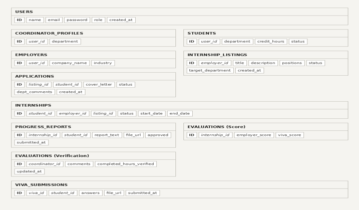
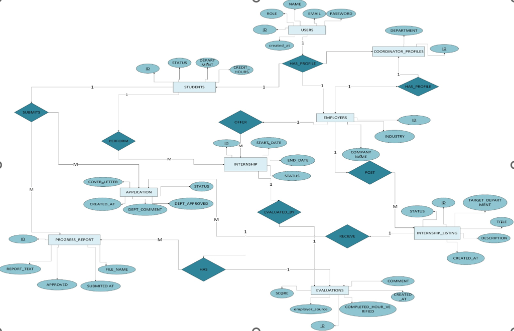

# Internship Management System

A full-stack web application developed as a 4th semester university project to streamline the internship management process for students, employers, and coordinators. The system provides a centralized platform for managing internship postings, applications, evaluations, and progress tracking.

---

## Features

- Secure User Authentication
- Role-Based Access Control
- Student Dashboard
- Employer Dashboard
- Coordinator Dashboard
- Internship Listings
- Internship Applications
- Internship Progress Tracking
- Viva Evaluation
- Credit Verification
- File Uploads using Supabase Storage

---

## Tech Stack

### Frontend
- HTML
- CSS
- JavaScript

### Backend
- Python
- Flask

### Database
- PostgreSQL (Supabase)

### Storage
- Supabase Storage

---

## Project Structure

```
internship-management-system/
│
├── backend/
│   ├── config/
│   ├── routes/
│   ├── requirements.txt
│   └── app.py
│
├── frontend/
│   ├── css/
│   ├── js/
│   └── pages/
│
├── Presentation/
│   └── Internship_Management_System_Presentation.pptx
│
├── Documentation/
│   └── Internship_Management_System_Report.pdf
│
├── Screenshots/
│   ├── Schema.png
│   └── Entity Relationship Diagram.jpg
│
├── README.md
└── .gitignore
```

---

## Installation

### 1. Clone the repository

```bash
git clone https://github.com/fizzahahmed/internship-management-system.git
```

### 2. Navigate to the project folder

```bash
cd internship-management-system
```

### 3. Install the required dependencies

```bash
pip install -r backend/requirements.txt
```

### 4. Create a `.env` file inside the `backend` folder

```env
SUPABASE_URL=your_supabase_url
SUPABASE_KEY=your_supabase_anon_key
```

### 5. Run the application

```bash
python backend/app.py
```

---

## Documentation

The **Documentation** folder contains the complete project report, including:

- Project Introduction
- Problem Statement
- Objectives
- System Design
- Implementation Details
- Testing
- Conclusion

---

## Presentation

The **Presentation** folder contains the project presentation, including:

- Project Overview
- System Workflow
- Application Features
- User Dashboards
- Database Schema
- Entity Relationship Diagram (ERD)
- Project Demonstration

---

## System Design

### Database Schema



---

### Entity Relationship Diagram (ERD)



---

## Future Enhancements

- Email Notifications
- Resume Upload Support
- Internship Recommendation System
- Analytics Dashboard
- Mobile Responsive Interface
- Advanced Search and Filtering
- Real-time Notifications

---

## Author

**Fizzah Ahmed**

Bachelor of Computer Science (4th Semester)

---

## License

This project was developed for educational and learning purposes.

